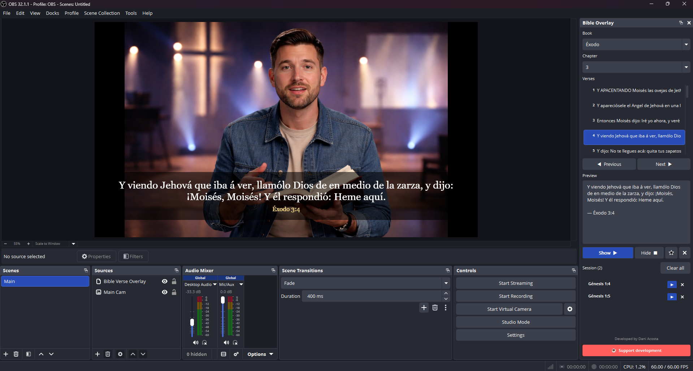

<p align="center">
  
</p>

# Bible Verse Overlay — OBS Plugin

An OBS Studio plugin to display Bible verses as an overlay in your streams or recordings, with a built-in control panel docked directly inside OBS.

---

## Features

- 📖 Full navigation by book, chapter, and verse
- 👁️ Show and hide the verse on screen with one click
- ⭐ Session list to save frequently used verses
- ▶️ Quick playback from the saved session
- 🌐 Interface in **English** or **Spanish** based on OBS language setting
- 💾 Panel remembers its position and visibility between restarts
- 🎨 Adapts to OBS color themes (dark, light, etc.)

---

## Requirements

- OBS Studio **31.0** or later
- Windows 10/11 (64-bit)

---

## Installation

1. Download the `.zip` file from [Releases](../../releases)
2. Extract the contents directly into your OBS Studio folder  
   (default: `C:\Program Files\obs-studio\`)
3. Place your Bible JSON file (e.g. `rv1909.json`) in:  
   `C:\Program Files\obs-studio\data\obs-plugins\obs-bible-verse-overlay\`
4. Restart OBS Studio
5. The **Bible Overlay** panel will appear under *Docks* in the menu bar

---

## Bible data format

The plugin requires a JSON file with Bible data. The expected format is:

```json
{
  "version": "King James Version",
  "books": [
    {
      "id": 1,
      "name": "Genesis",
      "abbrev": "gn",
      "chapters": [
        {
          "chapter": 1,
          "verses": [
            { "verse": 1, "text": "In the beginning God created..." }
          ]
        }
      ]
    }
  ]
}
```

---

## Building from source

### Prerequisites
- Visual Studio 2022
- CMake 3.28+
- OBS Studio pre-built deps (downloaded automatically)

### Steps

```bash
# Configure
cmake --preset windows-x64

# Build
cmake --build build_x64 --config RelWithDebInfo
```

The output `.dll` will be in `build_x64\RelWithDebInfo\`.

---

## Credits

Developed by **Dani Acosta**  
[☕ Support on Ko-fi](https://ko-fi.com/daniacostadev)

---

## License

GNU General Public License v2.0 — see [LICENSE](LICENSE)
